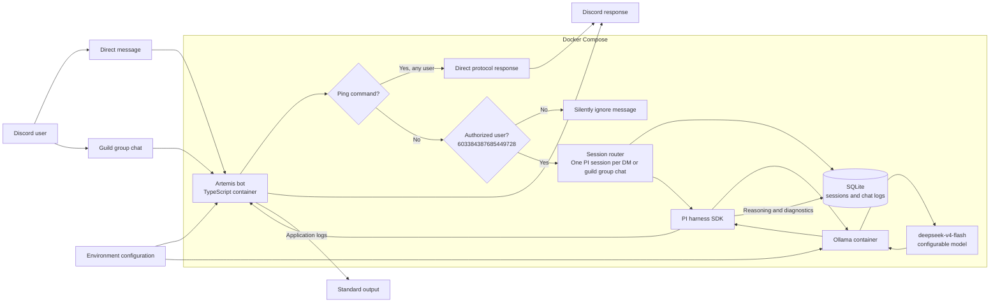

# Artemis Discord Bot Design

Status: Proposed

Source: [HSV-AI/artemis issue #1](https://github.com/HSV-AI/artemis/issues/1)

Last updated: 2026-08-19

## Summary

Artemis is a community-run Discord bot that supports AI-assisted conversations in direct messages and guild chats. The first release is deliberately small: it serves one Discord server, allows one configured user to converse with the model, exposes a public `/ping` health command, and preserves each chat's context across restarts.

The implementation uses PI and the PI SDK as the conversational harness, Ollama as the initial model provider, SQLite for durable sessions and chat logs, and Docker Compose for local operation. Configuration and credentials are supplied through an uncommitted `.env` file.

## Goals

- Connect reliably to one configured Discord server.
- Support conversations in direct messages and guild channels, treating threads as part of their parent guild channel.
- Keep every Discord conversation isolated and durable.
- Allow only Discord user `603384387685449728` (`.mattieb`) to converse with the model initially.
- Let any Discord user run `/ping` and receive exactly `pong` without touching the AI or conversation state.
- Make the model and runtime settings configurable without code changes.
- Record enough activity, errors, chat history, and available model diagnostics for operators to debug conversations.
- Make the project approachable for community members to run and learn from locally.

## Non-goals for the first release

- Supporting more than one Discord server.
- Providing a general user, role, or server administration system.
- Supporting model providers other than Ollama.
- Sharing context across unrelated direct messages or guild channels.
- Building a hosted control plane or managed deployment service.
- Requiring Ollama or Docker integration tests in the automated test suite.

## Requirements and design responses

| Requirement | Design response |
| --- | --- |
| One Discord server | Require a configured guild ID and reject or ignore events from other guilds. Direct messages remain supported. |
| Public `/ping` | Handle `/ping` in the Discord adapter before authorization, persistence, or PI invocation and reply with exactly `pong`. |
| One authorized conversational user | Compare the message author's Discord user ID with the configured initial allowlist before loading a conversation or invoking PI. Unauthorized normal messages receive no response. |
| Direct-message and guild conversations | Derive a stable conversation key from the Discord context. Direct messages use the DM channel ID. Guild messages, including thread replies, use the guild ID plus the parent channel ID. |
| Isolated, persistent context | Associate each conversation key with one durable PI session and store its session state and messages in SQLite. Never query history without the conversation key. |
| Configurable model and runtime | Read validated settings from environment variables loaded through `.env` for local use. |
| Reconnection | Use the Discord client's reconnect and resume behavior, and log connection lifecycle events. |
| Debuggable operation | Emit structured application logs and persist sessions, chat messages, model metadata, and available reasoning or diagnostics. |

## Implementation decisions from the issue comments

The following choices come from the [implementation comment on issue #1](https://github.com/HSV-AI/artemis/issues/1#issuecomment-5349536413) and are constraints for the initial implementation.

| Comment direction | Implementation detail |
| --- | --- |
| Use PI and the PI SDK as the base harness | PI owns the model-facing conversation lifecycle. Discord-specific code sits outside PI behind an adapter so the main flow remains easy for a first-time chatbot contributor to follow. |
| Save all sessions and chat logs to SQLite | SQLite is the durable system of record for conversation identity, PI session references or state, user and assistant messages, model metadata, and available reasoning or diagnostic data. |
| Community members must be able to run locally | A documented local workflow requires only Discord credentials, the configured Ollama access, and Docker Compose. Persistent data lives in a named or bind-mounted local volume. |
| Start with Ollama and `deepseek-v4-flash:0731-cloud` | Ollama is the initial model boundary and `deepseek-v4-flash:0731-cloud` is the default model. The model remains configurable without a code change. |
| Store configuration in `.env` | Local configuration is loaded from `.env`; `.env` is ignored by Git, while a non-secret `.env.example` documents every required value. Startup fails clearly when required configuration is absent or invalid. |
| Use Docker and Docker Compose | The project supplies an Artemis image and a Compose definition for local startup. Compose starts Ollama as a separate dependency container, mounts durable data, injects `.env`, and connects Artemis to Ollama over the Compose network. Ollama is not installed in the Artemis image. |
| Create design docs | This document is the initial design baseline and should be updated when implementation decisions change. |

## High-level architecture

### Component responsibilities

#### Configuration

Configuration is loaded once at startup, parsed into a typed runtime object, and validated before any network connection or database mutation. At minimum it includes:

- Discord bot token and target guild ID.
- Authorized conversational user ID, defaulting to `603384387685449728` where a safe default is appropriate.
- Ollama endpoint and model, with `deepseek-v4-flash:0731-cloud` as the default model.
- SQLite database path.
- Log level and other non-secret runtime controls.

Secrets are never committed, printed, or included in error payloads. `.env.example` contains names and safe examples only.

#### Discord adapter

The Discord adapter owns gateway connection, interaction registration, incoming-event normalization, outbound replies, and connection lifecycle logging. It exposes normalized events to the application rather than leaking Discord SDK objects into the conversation core.

The adapter distinguishes `/ping` interactions from normal chat messages immediately. Bot-authored messages and events from guilds other than the configured guild are ignored to prevent loops and unintended operation.

#### Ping handler

The ping path is independent of the conversational path. It performs no authorization check, database read or write, PI call, or Ollama call. Its entire user-visible response is exactly `pong`.

#### Conversation authorization

Normal chat is accepted only when the author's Discord ID matches the configured authorized user. Rejected messages are not sent to PI and do not create or alter conversation records. They produce no Discord response; optional debug logging is metadata-only and must not include the message body.

#### Conversation coordinator

The coordinator maps a normalized Discord event to a stable conversation key, restores or creates the corresponding PI session, submits the message, persists the result, and returns the response to Discord.

Conversation keys are namespaced by context:

- Direct message: `dm:<channel-id>`
- Guild channel: `guild:<guild-id>:channel:<channel-id>`

Discord channel IDs are immutable identifiers. Human-readable names are stored only as optional metadata and never used as keys. A Discord thread belongs to its parent guild channel and therefore uses that parent channel's conversation key rather than creating an independent conversation.

When an authorized user replies in a thread, the coordinator fetches the complete thread in Discord order, including the new message, and submits that thread snapshot to PI for the current turn. The snapshot preserves author and message identity so the model can follow the discussion. Messages from other users may appear in this snapshot as context, but only a new message from the authorized user can trigger model generation. Repeated snapshots do not create duplicate SQLite message rows because source Discord message IDs are deduplicated.

Work for the same conversation is serialized so two rapidly arriving messages cannot race while updating one session. Different conversations may run concurrently. Discord message IDs provide idempotency so a redelivered event is not submitted to the model twice.

#### PI and Ollama boundary

PI is the base conversational harness and owns interaction with the configured model through Ollama. Application code supplies the isolated conversation session and user message, then consumes the assistant response plus any available reasoning or diagnostic metadata.

The model name is configuration, not a conditional embedded in application logic. Changing from the default `deepseek-v4-flash:0731-cloud` therefore requires a configuration update and restart, not a code change. Ollama-specific calls remain behind a narrow boundary so unit tests can substitute a deterministic fake.

#### Persistence

SQLite stores all durable conversational data. A minimal logical schema includes:

- `conversations`: stable conversation key, Discord context metadata, timestamps, and active-session reference.
- `sessions`: conversation ID, PI session identifier or serialized state, model, lifecycle status, and timestamps.
- `messages`: session ID, Discord message and thread IDs where applicable, role, content, model metadata, available reasoning or diagnostics, and timestamp.
- `events`: structured operational events that need durable correlation with a session or message.
- `schema_migrations`: applied schema version history.

Foreign keys are enabled. Conversation keys and inbound Discord message IDs are uniquely constrained. Message and session writes for a model turn occur in a transaction so a partial write cannot appear as a completed exchange.

The SQLite file lives on a persistent Docker volume and remains available across container restarts and upgrades. Schema migrations run before Discord connects and must be backward-safe for existing local data.

There is no automatic retention or deletion policy. Chat content, session data, and model reasoning or diagnostics remain in SQLite indefinitely unless an operator deliberately removes records or deletes the local data volume.

#### Logging and operator access

Application logs are structured and written to standard output for `docker compose logs`. Each relevant event includes correlation fields such as conversation ID, session ID, and Discord message ID, but excludes credentials and avoids message content by default.

Chat content, PI session history, and model-provided reasoning or diagnostics are stored in SQLite as required for conversation debugging. These records are sensitive: only local operators should have database access, and documentation must warn against publishing or committing the database file.

#### Container topology

Docker Compose starts at least two separate services:

- `ollama`: the model service and an explicit runtime dependency of Artemis, with its own persistent data volume where required.
- `artemis`: the Discord bot application, built from the Artemis Dockerfile, with its SQLite data volume and configuration from `.env`.

The Artemis Dockerfile contains only the application and its runtime dependencies; it does not install or launch Ollama. The Artemis container reaches Ollama by its Compose service name over the internal Compose network. Compose waits for Ollama to become healthy before starting Artemis so the bot does not connect to Discord with an unavailable required model dependency.

## Runtime flows

### Startup

1. Load and validate environment configuration.
2. Open SQLite, enable foreign keys, and apply migrations.
3. Initialize the PI/Ollama boundary using the configured model.
4. Register Discord interactions and connect the Discord client.
5. Log a successful ready event including the connected bot identity and configured guild ID, but no secrets.

If configuration, migration, or required model setup fails, startup exits with a clear error instead of connecting in a partially working state.

### `/ping`

1. Receive and identify the `/ping` interaction.
2. Reply with exactly `pong`.
3. Do not authorize the user, resolve a conversation, access SQLite, invoke PI, or invoke Ollama.

### Normal message

1. Ignore bot-authored messages and unsupported guilds.
2. Check the author ID; silently stop if it is not authorized.
3. For a thread reply, fetch the complete thread in Discord order, including the new message.
4. Derive the conversation key from the DM channel or the parent guild channel.
5. Serialize work behind that conversation's queue.
6. Within the conversation, deduplicate source messages by Discord message ID.
7. Restore or create the durable PI session and persist any new inbound messages.
8. Submit the current message, or the complete thread snapshot for a thread reply, to PI through the configured Ollama model.
9. Atomically persist the assistant response and available model diagnostics.
10. Send the response to the originating Discord conversation or thread.

If generation fails, Artemis records the failed attempt and sanitized diagnostics for operators. It does not fabricate an assistant turn or send anything to Discord. A later message reuses the last valid session state.

### Reconnection and restart

Transient Discord disconnects rely on the Discord client's resume and reconnect behavior with bounded backoff. Lifecycle events are logged. After a process or container restart, Artemis reopens SQLite and resolves the next incoming message to the existing conversation and PI session before generating a response.

## Failure handling

- Invalid or missing required configuration: fail startup with actionable field names and no secret values.
- SQLite unavailable or migration failure: fail startup; do not accept messages without persistence.
- Ollama unavailable during startup validation: report the provider/model failure and remain unhealthy.
- Ollama or PI failure during a turn: persist a sanitized failure event and log correlation IDs, but send nothing to Discord.
- Discord disconnect: reconnect automatically and log disconnect, retry, resume, and ready transitions.
- Duplicate Discord event: return without a second model invocation or duplicate persisted turn.
- Discord response too long: split at Discord-safe boundaries while retaining one assistant message in conversation history.

## Security and privacy

- Keep Discord and model credentials only in the local environment or an operator-provided secret mechanism; never commit `.env`.
- Ignore unauthorized normal messages before reading conversation state or invoking the model.
- Scope every persistence query by the stable conversation identifier.
- Do not expose chat history, model reasoning, tokens, or raw error payloads in routine application logs.
- Run containers as a non-root user where practical and grant write access only to the data volume.
- Bind locally exposed service ports to loopback by default.
- Treat the SQLite database and operator logs as sensitive user data, especially because stored records have no automatic expiration.

## Local development and operations

The expected contributor workflow is:

1. Copy `.env.example` to `.env` and provide Discord credentials and any required Ollama model credentials.
2. Start the separate Artemis and Ollama containers with `docker compose up`.
3. Watch readiness and reconnect events with `docker compose logs`.
4. Stop the stack without deleting the persistent data volume.

The README should document Discord application setup, required intents and permissions, Ollama authentication or model availability, first startup, database location, log access, upgrades, and safe cleanup.

## Testing and completion gates

Application code is tested with Vitest. Discord, PI, and Ollama are mocked at their external boundaries; Ollama and Docker integration tests are not required. Unit coverage has global statement, branch, function, and line thresholds of at least 80%.

Required tests include:

- `/ping` returns exactly `pong` for authorized and unauthorized users while proving that persistence, PI, and Ollama are untouched.
- Unauthorized normal chat is silently ignored without persistence or model calls.
- DM and guild-channel keys remain distinct and stable, while a thread resolves to its parent guild-channel key.
- Every authorized thread reply submits the complete ordered thread, including the new message, without duplicating persisted source messages.
- Repeated messages reuse the correct session after a simulated process restart.
- Context never crosses conversation keys.
- Duplicate Discord message IDs invoke the model once.
- Concurrent messages in one conversation are serialized.
- Configuration defaults and validation behave as documented, including the default model.
- Persistence transactions, migrations, and error paths preserve the last valid session state.
- PI or Ollama failures are logged without creating an assistant turn or sending a Discord response.
- Discord reconnect lifecycle events are handled without losing durable context.

`npm run guardrail` is the completion gate and runs all required checks, including the Vitest suite with coverage. A change is not complete until that command passes.

## Acceptance criteria traceability

| Issue acceptance criterion | Verification approach |
| --- | --- |
| Connect and log success | Adapter unit test plus a documented local smoke check. |
| Reconnect after interruption | Adapter reconnect-state unit test with the Discord boundary mocked. |
| Anyone receives exactly `pong` | Ping unit tests for authorized and unauthorized identities. |
| Ping does not affect AI or history | Assert zero calls to the persistence, PI, and Ollama boundaries. |
| Authorized user can chat in DM and guild contexts | Coordinator unit tests for each normalized context. |
| Other users are silently ignored | Authorization unit test asserting no reply, persistence, or model call. |
| Each conversation reuses durable context | Persistence and coordinator tests across fresh application instances. |
| No context leaks | Cross-key isolation tests using distinct DMs and parent guild channels, plus tests proving threads share only their own parent channel's key. |
| Model changes through configuration | Configuration and PI-boundary tests with a non-default model. |
| Secrets remain outside the repository | `.env.example`, `.gitignore`, secret-scanning guard, and review. |
| Activity and diagnostics are operator-accessible | Logging and persistence tests plus documented `docker compose logs` and SQLite access. |

## Resolved implementation questions

- Guild threads are part of their parent guild channel conversation. On each authorized thread reply, Artemis resubmits the entire ordered thread, including the new message, to the bot.
- SQLite has no automatic retention or deletion policy. Stored chat content, sessions, and model reasoning or diagnostics remain until an operator deliberately removes them.
- PI or Ollama generation failures are recorded for operators but produce no Discord response.
- Docker Compose starts Ollama as a separate dependency container. Ollama is not included in the Artemis Dockerfile or application container.

Changes to these decisions should update this document and, when they alter observable behavior, the source issue and acceptance criteria.
