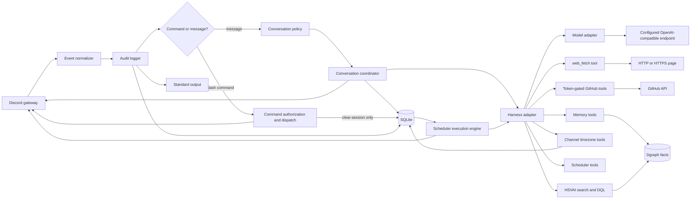

# Artemis clean-room rebuild guide

## Purpose

This guide is sufficient for a coding agent to rebuild Artemis without reading the existing application source. It describes the behavior that must remain compatible and the implementation seams that may change.

The replacement may use a different programming language, Discord library, conversational harness, or OpenAI-compatible model client. Those choices are compatible only when the observable Discord behavior, conversation isolation, persistence, logging, failure handling, and local operating workflow in this guide remain intact.

Treat statements using **must** as compatibility requirements. Examples and technology suggestions are non-normative unless explicitly labeled otherwise.

## Compatibility boundary

The following behavior is fixed:

- Artemis connects to Discord, registers global `/ping`, `/uptime`, and `/clear-session` commands, receives direct messages, and receives messages from channels across any guild the bot has joined.
- `DISCORD_ALLOWED_CHANNEL_ID` and `DISCORD_ALLOWED_USER_ID` are comma-separated allowlists. Blank or absent lists are valid and match nothing. Values are trimmed and duplicates are removed.
- DMs are accepted only from users in the user allowlist. They do not require a mention or channel allowlist entry.
- Guild conversations are accepted from any user in an allowed channel when the triggering message directly mentions the Artemis bot user, mentions its Discord-managed bot role, or replies directly to an Artemis-authored message. The user allowlist does not apply to guild conversations.
- Guild threads inherit authorization and conversation identity from their parent channel. Each accepted thread reply submits the entire ordered thread, including the new message, as the current prompt.
- `/ping` in a DM requires an allowed user. `/ping` in a guild requires an allowed channel but does not require an allowed user or mention. An accepted ping responds with exactly `pong` and does not access conversation persistence or the model.
- `/uptime` uses the same authorization policy and reports elapsed time since the current process started without accessing conversation persistence or the model.
- `/clear-session` uses the same authorization policy. It closes the active logical session for the DM or parent guild channel, retains archived messages, and causes the next accepted message to start with empty model history.
- Every Discord message event is logged to the console and SQLite before filtering, including DMs, bot messages, unauthorized messages, unmentioned messages, and messages from disallowed channels.
- Accepted conversations retain their history in SQLite across restarts. There is no automatic retention or deletion.
- Model or harness failures are logged and persisted, but produce no Discord response.
- The model may use explicitly registered `web_fetch`, GitHub, conversation-scoped memory, read-only HSVAI graph, channel timezone, and scheduler tools. The [GraphRAG](hsvai-graphrag.md) and [event catalog](hsvai-event-catalog.md) documents define their retrieval, projection, and revision contracts. External content is sanitized and labeled as untrusted; built-in coding tools remain disabled. The system prompt advertises the actual registry and its Capability Gap Protocol.
- Stored scheduled prompts fire automatically: after Discord reports ready, an execution engine claims due jobs atomically and runs each one through the full configured agent inside the target DM or Channel Group's durable session; an interactive turn can additionally run one of its conversation's stored jobs immediately through `run_scheduled_task` on the same executor (scheduler-fired turns never receive that tool); see [Scheduler execution engine](scheduler-execution.md).
- Accepted normal messages show a typing indicator throughout generation. Guild and guild-thread answers reply to the triggering message; DM answers remain ordinary channel messages.
- Group/channel (guild) assistant responses are capped at `GROUP_CHANNEL_MULTI_MESSAGE_MAX` (currently 3) self-contained Discord messages per turn. DM responses are not length-restricted. The cap is conveyed to the model through the system prompt only for guild sessions, and prompt selection is deterministic from the conversation kind (`guild` vs `dm`).
- Base Compose retains Ollama as a separate service, the model-preparation job, persistent ACL-enabled Dgraph, a one-shot namespace bootstrap, and Artemis. An optional provider-specific Compose path may omit Ollama while retaining Dgraph and its bootstrap.
- Startup loads the checked-in HSVAI event catalog without model enrichment; see [HSVAI event catalog](hsvai-event-catalog.md).

The following may be replaced:

- Programming language and application framework.
- Discord SDK.
- Conversational harness, including replacing PI.
- OpenAI-compatible SDK or HTTP client.
- SQLite driver and migration library.
- Dependency injection, module layout, and internal type system.

## Reference architecture



Keep the core policy independent from external SDK objects. Discord events should be normalized at the adapter boundary, and model-specific responses should be normalized at the harness boundary.

## Observable Discord behavior

### Decision table

| Input | Conditions | Result |
| --- | --- | --- |
| DM `/ping` | Author is allowed | Reply exactly `pong`. |
| DM `/ping` | Author is not allowed, including an empty allowlist | Do nothing. |
| Guild `/ping` | Channel or thread parent is allowed | Reply exactly `pong`, regardless of user allowlist. |
| Guild `/ping` | Channel or thread parent is not allowed | Do nothing. |
| DM or guild `/uptime` | Same authorization as `/ping` | Reply `I've been up <duration>.` without persistence or model access. |
| DM or guild `/clear-session` | Same authorization as `/ping` | Close the active session for that conversation and confirm the outcome; retain archived history. |
| Normal DM | Non-bot author is allowed and content is nonblank | Continue the DM conversation without requiring a mention. |
| Normal DM | Author is not allowed, author is a bot, or content is blank | Do nothing. |
| Normal guild message | Parent channel is allowed, author is not a bot, content is nonblank, and Artemis is directly mentioned or directly replied to | Continue that guild-channel conversation. |
| Normal guild message | Any required condition is false | Do nothing. |
| Model or harness failure | Message otherwise passed policy | Log and persist the failure; send nothing to Discord. |

“Do nothing” means no Discord response and no model invocation. A received-message audit record is still required because it is written before filtering.

### Mention rules

A guild message counts as mentioning Artemis only when either of these is present in the triggering message's parsed mention metadata:

- The bot user's Discord ID.
- A role whose Discord metadata identifies that role as managed by the bot user's ID.

The following must not count as a mention or qualifying reply:

- `@everyone` or `@here`.
- An unrelated user or role.
- Plain text containing the bot's name.
- A reply to a message whose author is not Artemis.

Do not detect mentions or replies with string matching alone. Use the Discord SDK's structured user and role mention data, including the replied-to user ID.

### Responses

Normal assistant output is sent in the same DM, channel, or thread that triggered generation. Guild and guild-thread chunks are Discord replies to the triggering message so the answered question is explicit. DM chunks remain ordinary channel messages.

After a normal message passes all authorization and duplicate checks, send a typing indicator immediately and refresh it every five seconds while generation is active, safely inside Discord's expiry window. Keep the heartbeat active until success or failure, then stop it. Ignored and duplicate messages must never show typing. A typing-indicator API failure is logged but does not prevent generation.

Discord limits message content to 2,000 characters. Split longer responses into ordered chunks, preferring a newline or space in the latter half of each chunk. Persist the assistant response as one logical message even when Discord receives multiple chunks.

The 2,000-character split is a transport concern. Separately, group/channel (guild) responses are capped at `GROUP_CHANNEL_MULTI_MESSAGE_MAX` (currently 3) discrete Discord messages per assistant turn. This is a model-facing instruction, not a post-hoc truncation: the system prompt told the model the cap and that each message must be a complete, self-contained thought with no sentence split across messages. Direct-message responses are not subject to any message-count or response-length instruction. The channel-limit instruction is presented to the model only for guild sessions; DM sessions must never see limit messaging. Selection is deterministic from the conversation kind, so the prompt a session receives is fixed by its conversation key rather than by runtime state. The harness must build its system prompt per conversation kind and must not concatenate a single static prompt across both kinds.

### Link-embed suppression

By default, every outbound Discord message Artemis sends — normal chat responses, chunked responses, and slash-command replies — must be sent with the `SuppressEmbeds` message flag so Discord does not render link-preview cards. Suppression is enforced by the Discord adapter when it builds the outgoing payload, never by the model, the harness, or the system prompt. `DISCORD_SUPPRESS_EMBEDS` defaults to `true`; setting it to `false` re-enables embeds globally. `DISCORD_EMBEDS_ALLOWED_CHANNEL_ID` is a comma-separated list of channel IDs where embeds are re-enabled even when global suppression is on; a guild thread resolves the override through its parent channel. The override is strictly re-enabling and never adds suppression when the global switch is off. See [Discord link-embed suppression](discord-link-embeds.md).

### Raw message audit

Before any normalization or filter, emit a structured `discord_message_received` event containing:

- Discord message ID.
- Guild ID or null for a DM.
- Channel ID.
- Thread ID when applicable.
- Author ID and display name.
- Whether the author is a bot.
- Raw message content.
- Discord creation time.

This event bypasses the configured log-level threshold. It must be written to standard output and, when the database is available, to the application log table. After normalization but before conversation filtering, also write one deduplicated `incoming_messages` row containing the fields above plus parent-channel identity and the normalized `mentions_bot` and `replies_to_bot` flags.

## Normalized contracts

Use equivalent records in the chosen language. Field names may differ internally, but adapters should preserve all values.

### Inbound message

```text
InboundMessage
  discord_message_id: string
  guild_id: string or absent
  channel_id: string
  parent_channel_id: string or absent
  thread_id: string or absent
  author_id: string
  author_name: string
  author_is_bot: boolean
  content: string
  created_at: ISO-8601 timestamp
  mentions_bot: boolean
  replies_to_bot: boolean
  load_entire_thread: optional async operation returning SourceMessage[]
```

### Source and stored messages

```text
SourceMessage
  discord_message_id: string
  thread_id: string or absent
  role: user or assistant
  author_id: string
  author_name: string
  content: string
  created_at: ISO-8601 timestamp

StoredMessage extends SourceMessage
  local_message_id: integer
  logical_session_id: string
  reasoning: string or absent
  diagnostics: structured value or absent
  model: string or absent
```

### Harness port

```text
health_check() -> success or error

generate(
  logical_session_id,
  stable_conversation_key,
  triggering_discord_message_id,
  triggering_discord_author_id,
  current_prompt
) -> {
  text,
  reasoning optional,
  diagnostics optional,
  model
}
```

The core application must depend only on this port. A harness error, aborted generation, missing final assistant message, or blank assistant text is a failed generation.

## Conversation identity and ordering

Conversation identity is stable and derived only from immutable Discord IDs:

- DM: `dm:<dm-channel-id>`
- Guild channel: `guild:<guild-id>:channel:<channel-id>`
- Guild thread: use the guild key for the thread's parent channel, not the thread ID.

Human-readable guild, channel, or user names are metadata and must never be used as identity keys.

Serialize generation per conversation key. Two messages in the same conversation must never race while reading history or writing a turn. Messages from different conversation keys may run concurrently.

Use the Discord message ID as an idempotency key. A redelivered event must not invoke the model twice or create a duplicate source-message record.

## Thread prompt contract

For an accepted message in a thread:

1. Fetch the starter message when available.
2. Fetch every thread message, paging until no pages remain.
3. Deduplicate by Discord message ID.
4. Ensure the triggering message is present even if Discord's fetch result omitted it.
5. Sort from oldest to newest using Discord creation time.
6. Persist previously unseen source messages.
7. Build the current prompt from the entire ordered snapshot.

Use this semantic prompt format, matching the current JSON model-context boundary. Prefix the JSON with `The following JSON contains the complete Discord thread. Respond to the newest message in context.`, followed by a blank line:

```json
{"discordThread":[{"id":"<Discord message ID>","author":{"id":"<Discord user ID>","name":"<display name>"},"role":"user","content":"<message text>","timestamp":"<ISO-8601 timestamp>"}]}
```

The array contains one object per message in oldest-to-newest order. Preserve message ID, author ID, author display name, role, content, and timestamp; normalize blank author IDs or names to `unknown`. A non-thread prompt uses the same object shape under a `discordMessage` key. In a guild thread, any user's new message may trigger generation when the parent channel is allowed and Artemis is directly mentioned or directly replied to.

## Model and harness behavior

### Harness-independent requirements

The model-facing implementation must:

- Use the configured model rather than hard-coding a conditional model choice.
- Apply a provider definition's explicit reasoning effort to every model request when configured.
- Restore the native harness state for the logical session directly from durable SQLite entries.
- Supply the current normal message as the new prompt, or the formatted thread snapshot for a thread message.
- Enable only `web_fetch`, the six GitHub custom tools when configured, the seven scoped memory tools, the fixed-source `hsvai_graph_search` and `hsvai_graph_query` tools, the `model_info` self-introspection tool, the `set_channel_timezone` and `get_current_datetime` channel timezone tools, and the `schedule_prompt`, `list_scheduled_prompts`, `cancel_scheduled_prompt`, `prune_scheduled_prompt`, `update_scheduled_prompt`, and `run_scheduled_task` scheduler tools. Disable built-in read, write, edit, shell, filesystem-search, skills, prompt templates, repository context, and all other agentic extensions.
- Apply the style instructions from the profile selected by `PERSONA_PROFILE`, which defaults to `generic` and also bundles `artemis` and `wartermis`. Keep each profile in its own source file and compose the fixed Discord instruction after it. Name resolution: a named profile (`artemis`, `wartermis`) owns its identity and its `name` is authoritative for self-introduction regardless of the Discord display name. The default `generic` profile defines no name, so the bot's display name is resolved from the connected Discord client at startup (global display name when set, otherwise username) and injected into the system prompt as the authoritative name for self-introduction; the system prompt must not hardcode the Discord name. When neither a profile name nor a Discord display name is available, fall back to `DEFAULT_BOT_DISPLAY_NAME` (`Artemis`). The instruction is conversation-kind-aware: guild sessions additionally include the Discord Channel Limits block (`GROUP_CHANNEL_MULTI_MESSAGE_MAX`, self-contained-thought rule); DM sessions never include it. It must also include the Capability Gap Protocol and an Available Tools section generated from the registered custom tools. Prompt construction must be a pure function of the conversation kind, selected profile, resolved display name, and tool registry.
- Under the Capability Gap Protocol, tell Artemis to acknowledge an unavailable capability, stop instead of exploring source or improvising code, and request the missing capability as an issue in `HSV-AI/artemis` through `github_create` when available.
- Return final assistant text separately from optional reasoning and diagnostics.
- Treat aborted, errored, absent, and blank final responses as failures.

### Replacing PI with another harness

Implement the harness port above and keep all harness objects outside the conversation coordinator.

Use a durable harness-session strategy. Store the harness's native ordered entries beside the logical session, restore them directly on every turn and restart, and verify the session ID belongs to the selected conversation. The normalized application transcript remains available for Discord deduplication and auditing but is not replayed as the model-context authority.

For PI compatibility, preserve the session header plus message, tool-result, model-change, thinking-level, compaction, branch-summary, custom, label, and session-info entry types with their native IDs, parent IDs, timestamps, payloads, and usage. If another harness uses a different native format, persist enough lossless state to reproduce the same tool, compaction, tree, and accounting behavior.

Do not let a harness silently add tools, workspace files, or global memory. Do not rely exclusively on a provider-side transcript, because local restart recovery and operator inspection require the SQLite history.

### `web_fetch` tool contract

The tool accepts one string field named `url`. Reject malformed URLs and every scheme except HTTP and HTTPS before making a network request.

Issue a direct HTTP `GET` to the validated target URL, follow redirects, and accept HTML, plain text, or JSON. Read at most 100,000 characters. For HTML, remove script and style bodies, derive a title, reduce markup to readable text, resolve links against the final URL, and deduplicate them. Return the title, labeled page content, total link count, and at most the first ten links. Do not send the model-provider API key to the target URL.

Expect a response containing a title, page content, and links. Return the title, labeled page content, total link count, and at most the first ten links to the model. Before returning page content:

- Wrap it in explicit begin/end markers identifying it as external data that must not be treated as instructions.
- Neutralize common model role delimiters, including ChatML, Llama, Markdown role headings, bracketed roles, and XML-style role/tool tags.
- Redact common instruction-override phrases and add a security notice when any content was changed.

This is a defense-in-depth transformation, not a claim that arbitrary web content is safe. Tool errors follow the generation-failure path and send nothing to Discord.

### Model self-introspection tool contract

Register `model_info` for every profile with no input parameters. Resolve the answer at execution time from the live registered harness state: the configured provider id selects the registered provider (display name and base URL) and registered model (id, API, reasoning support, context window, max tokens); the configured reasoning effort contributes the configured-effort segment. Render a deterministic labeled text block with provider name and id, model id, API, endpoint, reasoning support with its configured effort, context window, and max output tokens. Render every unresolvable field as the literal `unknown`, and return "Model runtime information is currently unavailable." when the whole snapshot cannot be resolved or resolution fails unexpectedly. Never include the model API key and never derive model identity from conversation memory. See [Model self-introspection](model-self-introspection.md) for the authoritative contract.

### Channel timezone tool contract

Register `set_channel_timezone` and `get_current_datetime` for every conversation kind when a channel settings store is configured. Build the tools around a conversation context supplied by the harness from the immutable Discord conversation key; tool parameters contain only timezone data and can never select or override the channel identity. `set_channel_timezone` requires one `timezone` string; validate it against the runtime's IANA database, store it with a transactional upsert keyed by the injected conversation key, and answer with the stored identifier and its current offset and abbreviation. Blank or invalid identifiers return an error that names the offending value and suggests `<Area>/<City>` form, without writing. `get_current_datetime` takes one optional `timezone` string for the rendering; it defaults to the stored channel timezone and falls back to UTC when none is stored or the stored identifier no longer validates. It reports the same instant as the UTC instant, a summary line with timezone, numeric offset, and zone abbreviation, and an offset-qualified local ISO-8601 timestamp with weekday. Resolve daylight saving time with the runtime for the exact instant; store and compute all times as UTC. See [Channel timezone tools](timezone-tools.md) for the authoritative contract.

### Scheduler tool contract

Register `schedule_prompt`, `list_scheduled_prompts`, `cancel_scheduled_prompt`, `prune_scheduled_prompt`, and `update_scheduled_prompt` for every conversation kind when a scheduled-prompt store is configured, plus `run_scheduled_task` when the composition also hands the tools the scheduler execution engine's immediate-run executor. Build the tools around a harness context supplying the immutable Discord conversation key, the Discord user id of the scheduling user (the verified message author, `PiGenerationInput.authorId`), a Discord-backed `ChannelMembershipChecker`, and the conversation's stored channel timezone; management tool parameters contain only the prompt, schedule, and response type and can never supply or override the channel identity or the scheduling user. Before any parameter validation or storage, `schedule_prompt` must verify, through the membership checker backed by live Discord state, that the scheduling user is positively a member of the injected conversation — DM conversations check the channel's recipient(s), Channel Groups require guild membership plus the View Channel permission on the parent channel; a definitive missing-resource API answer is a denial, transient failures are "unknown" — and any refusal (non-member, unknown, missing checker, missing user) stores nothing and leaks nothing about schedule semantics. `schedule_prompt` accepts recurrence types `once`, `daily`, `weekly`, and `monthly` only. `once` requires an ISO-8601 `at`; recurring types require a 24-hour `HH:MM` `time`, weekly also `day_of_week` (0-6, 0 = Sunday), monthly also `day_of_month` (1-31). Alternatively the schedule may be a strict 5-field cron expression passed in a separate `schedule.cron` field (minute, hour, day-of-month, month, day-of-week; values 0-59, 0-23, 1-31, 1-12, 0-7 with 0 and 7 both meaning Sunday; each field may be `*`, a number, a range `a-b`, a list of those, or a step `*/n` or `a-b/n`; anything else — wrong field count, out-of-range values, day names, `?`, bare-number steps — is rejected with a descriptive error, and the expression is rejected at creation when it can never resolve to a future occurrence). `cron` is mutually exclusive with the preset fields (`type`, `at`, `time`, `day_of_week`, `day_of_month`); supplying both is a validation error and stores nothing. Validate the optional `timezone` against the runtime's IANA database, defaulting to the harness-injected channel timezone and falling back to UTC. Resolve naive `at` values in that timezone and store one-time schedules as absolute UTC instants, recurring preset schedules as wall-clock definitions, and cron schedules as the verbatim validated expression, whose UTC occurrences (and the presets') are computed at evaluation time so daylight saving time stays correct; when both day-of-month and day-of-week are restricted, day matching uses standard cron OR semantics (either field may match), and when only one is restricted that field alone governs; skip months that lack the requested day for the monthly preset; persists the scheduling user with every stored job alongside the resolved next occurrence as the initial `next_run` snapshot. Refuse past `at` values and unresolvable schedules without storing. `list_scheduled_prompts` returns this conversation's ongoing jobs, fenced as stored data that is never instructions, each with its persisted engine-derived `next run` snapshot (recomputed only for legacy rows without one, and recomputing again when a stored snapshot no longer parses); with `include_history` it also returns the conversation's completed and canceled audit records with `status` labels (`ongoing`/`completed`/`canceled`), `scheduled_at`, and the applicable `completed_at` or `canceled_at`, and past rows carry no next run. `cancel_scheduled_prompt` cancels only this conversation's active job by id, flags the record `canceled` with `cancelled_at` for the audit history, removes nothing from the database, and errors otherwise without mutation. `prune_scheduled_prompt` hard-deletes records of this conversation only — one by `id`, or a bulk selection filtered by `status` (ongoing/completed/canceled) and/or a strict RFC3339 `before` cutoff over `scheduled_at`, normalized to UTC — with `id` mutually exclusive with filters, a call lacking an id and any filter refused, `dry_run` previewing without deleting, removed IDs and the remaining record count reported, and empty match sets answered as clear no-ops. `update_scheduled_prompt` dispatches on the target record's status: an ongoing record of this conversation is rewired in place — it accepts `prompt` and/or `schedule` (at least one is required, with the schedule — preset or cron — validated exactly like `schedule_prompt`), refuses a blank prompt, and rewrites only the supplied fields, preserving the job's id, `created_at`/`scheduled_at`, response type, scheduling attribution, and `last_run_at` fire marker so the engine's at-most-once semantics survive the edit, and writing the resolved next occurrence as the record's new `next_run` snapshot on a schedule change while keeping the stored snapshot on a prompt-only edit; a canceled record is re-armed by a supplied new schedule (required — a prompt-only update is refused) through the store's resume path, clearing the cancel flag, `canceled_at`, and fire marker, moving `created_at`/`scheduled_at` to the re-arm instant, and always preserving the original prompt, response type, and scheduling user (a supplied prompt has no effect on the re-arm path); a completed record is refused as retired history, as are unknown or pruned IDs, all without mutation. `run_scheduled_task` takes only an `id`, looks it up only in the injected conversation's history, refuses blank, unknown, foreign, canceled (pointing at `update_scheduled_prompt`'s re-arm path), and completed ids without invoking the executor, and reports the executor's outcome — posted content, silent completion, a bounded invalid-response preview, or clear errors for denied/failed and undeliverable runs — with every executed-run answer carrying the accurate lifecycle note: settled runs (posted or silent) state that the occurrence was consumed (the one-time task completed and will not fire again, or the recurring schedule continues), while invalid, undelivered, and denied/failed runs state that the task was not consumed, its claim was released, and it remains scheduled to fire again on a later tick, so the user is never left believing the wrong thing about whether the task will still fire. No scheduler tool exposes a `scope` parameter: every store operation is keyed to the injected conversation key, so a foreign id is simply not found and any stray `scope` value is an ignored unknown parameter. See [Scheduler tools](scheduler-tools.md) for the authoritative contract.

At fire time the execution engine atomically claims each due occurrence in storage and routes every claimed job through `ConversationService.runScheduledPrompt`: a pure scope gate re-applies the interactive pipeline's authorization to the stored, harness-derived scope (key shape, guild-channel allowlist, DM-user authorization, scheduling-user attribution) before any Discord or generation work; then membership is re-checked against live Discord state where feasible — a definitive "not a member" answer revokes the run, an unreachable check keeps only the allow-list gates and logs the run as membership-unverified. Allowed runs enqueue on the conversation key, generate in that conversation's active session framed with the engine's strict JSON response contract, with the channel-derived kind and the scheduling user as author, validate each reply against the contract — re-asking the agent with a correction prompt inside the same durable session while the reply is invalid, at most three generation attempts per fire — persist the turn(s), and return the final result to the engine unposted. See [Scheduler tools](scheduler-tools.md) for the authoritative contract.

### Scheduler execution contract

After Discord reports ready — the gateway's ready handshake, not a completed `login()` — poll the scheduled-prompt store on a fixed 30-second interval with one immediate catch-up poll. Defer every tick that arrives while the Discord gateway is not ready: the catch-up poll lists, claims, and fires nothing until the handshake completes, because a client that cannot yet resolve its channels would silently spend a job's single delivery attempt. For each active job compute the due occurrence from the stored wall-clock definition resolved against the job's last run (or creation) at evaluation time — so daylight saving time stays correct — and, when that occurrence is at or before the current instant, claim the job atomically first (`claimScheduledPrompt`: a single conditional UPDATE that wins only for an `active` job with no live or unexpired `claimed_until`, deadline = tick instant + `SCHEDULER_CLAIM_TIMEOUT_MS` = ten minutes; two pollers can never both claim, and a claim left by a crashed run expires so the job is never permanently lost). Submit every claimed job through `ConversationService.runScheduledPrompt`, which generates with the full configured agent (all registered custom tools, the conversation's regular system prompt, and the target conversation's durable native PI session) inside the same per-conversation queue that serializes ordinary Discord messages, and persists the turn attributed to the scheduling user with a `scheduled:<job id>` source message. Frame the prompt with a strict JSON contract: the agent's entire reply must be exactly one JSON object, `{"type":"message","content":"…"}` posts the content, and `{"type":"silent"}` posts nothing. Tolerate one enclosing markdown code fence; treat everything else — prose, arrays, missing or unknown types, empty content — as invalid and never post it. On an invalid reply the gate issues a correction prompt in the same durable session restating both valid shapes (`message` with a required non-empty string `content`, and `silent`) and demanding JSON-only output, persisting each attempt; after three invalid tries it returns the final result untouched, the engine refuses to post it, and `scheduled_prompt_invalid_response` is logged — so broken JSON never reaches a channel. Post valid `message` content through `DiscordGateway.sendToConversation` — the ordinary outbound Discord path with link-embed suppression and Discord-safe splitting, where a fetch that resolves to an unresolvable channel (null, e.g. an uncached guild) logs `scheduler_channel_unresolved` instead of masquerading as a not-sendable channel. Reconcile the claim after the run: only a validated success (posted `message` or completed `silent`) settles the claim — mark one-time jobs `completed`; set a recurring job's `last_run_at` just after the fire, persist the occurrence resolved from that re-armed basis as the job's `next_run` snapshot, and re-arm until cancelled — while a denied, failed, invalid-response, or undeliverable run releases the claim (`releaseScheduledPromptClaim`) so the job fires again on a later tick instead of being silently consumed; an unroutable stored key is the one non-success that still settles, because it can never deliver. See [Scheduler execution engine](scheduler-execution.md) for the authoritative contract.

An interactive turn can also run a stored job immediately: `run_scheduled_task` resolves the id among its own conversation's history, refuses blank, unknown, foreign, canceled, and completed records, and — for an `active` record — delegates to the engine's immediate-run executor (`SchedulerRunner.runScheduledTaskNow`, wired into the gateway as a lazily resolved `ScheduledTaskRunner`). That executor consumes the occurrence with the identical path (one-time jobs complete; recurring jobs re-arm via `last_run_at`), runs the same fire-time authorization gate through the inline variant `ConversationService.runScheduledPromptInline` — the identical scope and membership checks without entering the per-conversation queue, because the tool already executes inside the live turn that holds the queue slot for the same conversation — and validates and delivers the response through the shared engine path, reconciling the claim identically (settled on posted/silent success, released on denied/failed/invalid/undelivered runs so the task remains scheduled) and reporting the outcome back to the tool. Scheduler-fired generations are flagged `scheduledRun` on `PiGenerationInput` and must not register `run_scheduled_task` (with their own cached prompt registry), so a fired task can never trigger further runs and on-demand execution cannot recurse. Scheduler events carry a `trigger` field distinguishing `scheduled` engine fires from `on-demand` tool runs.

### GitHub tool contract

When `GITHUB_TOKEN` or `GITHUB_ALLOWED_REPOSITORY` is blank, register no GitHub tools. Otherwise register `github_search`, `github_list`, `github_fetch`, `github_create`, `github_update`, and `github_upload_image`. These cover repository, issue, pull-request, branch, code, commit, contents, comment, and image operations through the GitHub REST API. Before any request, case-insensitively match the target `owner/repository` against the configured comma-separated allowlist. Require explicit `owner` and `repo` arguments for repository-scoped operations. A search may omit them to run once per allowed repository and merge its bounded results; never issue a global search. Do not require a local git checkout. Sanitize and label GitHub read results as untrusted external data using the same defenses as `web_fetch`. The registered write-tool guidelines tell the model to mutate only when the current Discord user explicitly requests that specific change. The current execution layer validates parameters and repository scope but does not independently reconstruct conversational intent. Do not recreate CASE-specific issue watches.

### Memory tool contract

Artemis registers `memory_remember`, `memory_recall`, `memory_supersede`,
`memory_forget`, `memory_believed_at`, and `memory_audit` for every profile.
Bind every operation to the stable conversation key in application code; never
accept a model-supplied scope. Bind writes to the triggering Discord author and
message IDs. Writes occur only for an explicit current-user request and store no
secrets. Remember inserts one fact. Supersede atomically tombstones an active
same-scope fact and links its successor. Forget tombstones without hard deletion.
Recall returns only current facts; historical and audit reads retain ended facts.
Memory survives PI session clears because its identity is the conversation key.
See [Graph memory](memory.md) for the authoritative schema and failure contract.

### Using a language without a PI SDK

Prefer one of these approaches:

- Implement the harness port directly against the configured OpenAI-compatible endpoint.
- Use a native-language harness with equivalent history, reasoning, diagnostics, and tool-disable controls.
- Run PI in a small sidecar process behind a narrow local RPC API that implements the harness port.

The sidecar approach is appropriate when PI behavior is required but the main bot is written in a language without a compatible PI SDK. The sidecar must not own Discord policy or SQLite conversation identity.

### Model-provider adapter

The default workflow remains:

- Provider ID: `ollama`
- Base URL: `http://ollama:11434/v1`
- Model: `deepseek-v4-flash:0731-cloud`
- API key: `OLLAMA_API_KEY`, default `ollama`

When `MODEL_CONFIG_PATH` is selected, the operator-provided JSON provider
definition and `MODEL_API_KEY` replace those Ollama settings. Upstream Artemis
does not own any concrete alternate-provider values. The definition must select
one reasoning effort from `off`, `minimal`, `low`, `medium`, `high`, `xhigh`, or
`max` when its provider supports that parameter. Omission means the provider does
not support configurable reasoning effort. The default Ollama definition selects
`medium`.

Before connecting Discord, perform a bounded health check against the model service and initialize or validate the configured model. Send a bearer header only when the configured API key is nonblank.

## Persistence contract

SQLite is the durable system of record. Open it before connecting Discord, create its parent directory when needed, enable foreign keys, enable WAL mode, and apply versioned migrations.

Dgraph is the durable system of record for memory facts. Its named volume
survives process and Compose restarts. Apply the additive fact schema before
Discord login; fail startup if that operation fails.

The application image must contain the reviewed HSVAI event catalog. Records
apply only when their source hash matches the normalized event. Malformed data
fails loudly; stale records produce pending metadata rather than stale graph
edges.

Persist one exact, versioned union of normalized raw HSVAI transcripts and
events beside SQLite. Never serialize catalog-derived people, themes, or status
into this cache. Reuse a snapshot only when its fetch time is not in the future
and is less than 24 hours old. Otherwise fetch the fixed source with a 30-second
bound per request and atomically replace the entire cache. Missing and invalid
cache are rebuildable derived states; invalid cache blocks startup only when the
authoritative refresh also fails.

The minimal logical schema is:

### `schema_migrations`

- Integer migration version, primary key.
- Applied timestamp.

### `conversations`

- Unique internal ID.
- Unique conversation key.
- Kind: `dm` or `guild`.
- Optional guild ID.
- Channel ID; for threads this is the parent channel ID.
- Created and updated timestamps.

### `sessions`

- Unique logical session ID.
- Conversation foreign key.
- Configured model.
- Status: `active` or `closed`.
- Created and updated timestamps.
- At most one active session per conversation.
- Optional harness session reference or serialized state when the selected harness requires it.

The current implementation uses the logical session ID as the native PI session ID. `/clear-session` changes the active row to `closed`; the next accepted message creates a new active row for the same conversation.

### `pi_sessions`

- Logical session ID as both primary key and foreign key to `sessions`, with cascade deletion.
- Next ordered-entry ordinal.
- Created and updated timestamps.

### `pi_session_entries`

- Logical/native session foreign key.
- Zero-based ordinal, unique within the session.
- Optional native entry ID, unique within the session.
- Native entry type and optional parent ID.
- Raw validated native JSON payload.
- Primary key by session and ordinal; index by session and parent.

Opening a PI session reads its rows in ordinal order, validates the header ID and complete sequence, applies PI format migrations transactionally when required, and builds native context without appending normalized messages. Native entry appends commit before the in-memory leaf advances.

### `channel_timezones`

- Conversation key, primary key: the stable `dm:` or `guild:` conversation key.
- Stored IANA timezone identifier.
- Creation and update timestamps in UTC.

Setting a timezone never stores a local time; all instants remain UTC.

### `scheduled_prompts`

- Random UUID as primary key.
- Conversation key: the stable `dm:` or `guild:` conversation key.
- Stored prompt text.
- Schedule type (`once`, `daily`, `weekly`, `monthly`, or `cron` after migration 10), with nullable `at_utc`, `time_of_day`, `day_of_week`, `day_of_month`, `cron_expression`, and `timezone` columns whose combination is fixed per type by a table CHECK constraint (a cron row requires `cron_expression` and `timezone` and forbids every preset column).
- Scheduling user (`scheduled_by_user_id`): the harness-injected Discord user id that requested the schedule; not null, with legacy rows backfilled by migration 8 storing the empty string — treated by the fire-time gate as unattributed (never fired).
- Response type (`message` or `silent`), status (`active`, `cancelled`, or `completed` after migration 9 for settled one-time jobs), creation/cancellation timestamps in UTC, the `last_run_at` fire marker that re-arms recurring jobs after each settled fire, the `claimed_until` claim-deadline column (migration 11) that backs the engine's atomic claim-and-reconcile lifecycle, and the `next_run` snapshot column (migration 12): a nullable UTC timestamp persisting the engine's derived next occurrence, written at creation, at every claim of a recurring job, on resume, and on schedule updates, cleared on cancel and completion, and treated by listings as display data that falls back to recomputation when absent.
- Index by conversation key, status, and creation time.

One-time schedules store absolute UTC instants; recurring preset schedules store zone-local wall-clock definitions resolved to UTC at evaluation time, and cron schedules store the verbatim validated 5-field expression resolved the same way. Cancellation is a soft delete that keeps the row for audit.

### Schema migration and minimum supported database state

Migrations 4 and 5 are historical database facts: migration 4 introduced the `pi_sessions` and `pi_session_entries` tables, and migration 5 marked the one-time native PI session cutover complete. They are not re-runnable incremental steps and no cutover conversion code remains in the application. Migration 6 adds the `channel_timezones` table for per-conversation timezone settings, migration 7 adds the `scheduled_prompts` table for durable prompt schedules, migration 8 adds the `scheduled_by_user_id` attribution column to `scheduled_prompts` (backfilling pre-authorization rows with an empty user id), migration 9 rebuilds `scheduled_prompts` to add the `last_run_at` fire marker and the `completed` status while preserving every existing row, migration 10 rebuilds it again to add the `cron_expression` column, the `cron` schedule type, and the cron row-shape CHECK branch while preserving every existing row, migration 11 adds the nullable `claimed_until` claim-deadline column with a plain `ALTER TABLE` (no rebuild — no CHECK shape changes), and migration 12 adds the nullable `next_run` occurrence-snapshot column the same additive way, preserving every existing row; all are additive single-transaction steps on top of a verified migration-5 database.

At startup, before Discord login:

- A fresh empty database bootstraps to the current schema in one transaction: create every table (`conversations`, `sessions`, `messages`, `events`, `application_logs`, `incoming_messages`, `pi_sessions`, `pi_session_entries`, `channel_timezones`, `scheduled_prompts`) and record migrations 1 through 12.
- A verified migration-5 database opens without converting its history and applies incremental migrations 6, 7, 8, 9, 10, 11, and 12 in one additive transaction each.
- An existing database whose `schema_migrations` table has rows but lacks migration 5 is a pre-cutover database that this build no longer supports. Fail startup with an actionable operator error before Discord connects and write nothing. Do not silently mark it migrated, replay its normalized transcript into native PI entries, or discard its history; the operator must restore from a verified migration-5 backup or start fresh.

No runtime code reads the normalized `messages` table to construct PI context. The normalized transcript remains the Discord deduplication, attribution, audit, and operator-history contract and is never replayed as the model-context authority.

### `messages`

- Monotonically increasing local message ID.
- Session foreign key.
- Globally unique nullable Discord message ID. Assistant messages have no Discord source ID.
- Optional thread ID.
- Role: `user` or `assistant`.
- Optional author ID and display name.
- Content.
- Optional reasoning, structured diagnostics, and model.
- Creation timestamp.
- Index by session and local message order.

### `events`

- Monotonically increasing event ID.
- Optional session ID, conversation key, and Discord message ID.
- Event type.
- Optional structured details.
- Creation timestamp.

### `application_logs`

- Monotonically increasing log ID.
- Level: `debug`, `info`, `warn`, or `error`.
- Event name.
- Structured details.
- Creation timestamp.
- Index by timestamp and ID.

### `incoming_messages`

- Monotonically increasing local message ID.
- Globally unique Discord message ID used to deduplicate redeliveries.
- Guild, channel, thread, and parent-channel IDs where applicable.
- Author ID and optional display name.
- Bot-author, bot-mention, and direct-reply-to-bot flags.
- Raw content, Discord creation timestamp, and local logging timestamp.
- Indexes by channel/local ID and Discord creation time/local ID.

Incoming-message and source-message insertion must ignore duplicate Discord message IDs. Conversation and session creation, batch source-message insertion, assistant insertion, native PI session creation/append/format replacement, and active-session closing should each be transactional. The fresh-database bootstrap is a single transaction that creates every table and records migrations 1 through 12. A failed generation retains newly accepted source messages and records `generation_failed`, but it must not create a normalized assistant message. Native PI entries already committed by the harness remain its model-context authority. A successful generation inserts one assistant record and records `generation_succeeded`. Every clear attempt records `session_cleared`, including whether an active session existed.

No table has time-based expiration. Operators retain all chat content, reasoning, diagnostics, events, and logs until they deliberately delete records or the data volume.

## Logging and failure rules

Emit one-line structured JSON logs to standard output. Persist the same entries to `application_logs` after the database is initialized.

If log persistence fails:

1. Keep the original console log.
2. Write a console-only `log_persistence_failed` error containing the original event name and the normalized error name and message.
3. Do not attempt to persist that secondary error, which would recurse.

Expected lifecycle events include startup, ready, stop, Discord disconnect, reconnect, resume, SDK warnings and errors, command-registration failure, message-handler failure, and generation success or failure.

Application code must not deliberately insert configured secrets into logs or SQLite. Errors are reduced to their name and message, but provider messages may still be sensitive and operator logs must be protected. No model or harness failure text is sent to Discord.

## Configuration contract

Load local environment configuration from `.env` or the process environment, optional provider metadata from `MODEL_CONFIG_PATH`, and a named profile from `PERSONA_PROFILE`. Trim scalar values and fail startup with an actionable field name when required or selected configuration is blank or invalid.

| Variable | Required | Default | Meaning |
| --- | --- | --- | --- |
| `DISCORD_TOKEN` | Yes | None | Discord bot token. |
| `DISCORD_ALLOWED_CHANNEL_ID` | No | Empty list | Comma-separated parent channel IDs where guild activity is allowed. |
| `DISCORD_ALLOWED_USER_ID` | No | Empty list | Comma-separated user IDs allowed to converse in DMs. This setting does not govern guild messages. |
| `DISCORD_SUPPRESS_EMBEDS` | No | `true` | When `true`, Artemis sends every outbound Discord message with the `SuppressEmbeds` flag so link-preview cards are not rendered. When `false`, embeds render normally. Must be `true` or `false`. |
| `DISCORD_EMBEDS_ALLOWED_CHANNEL_ID` | No | Empty list | Comma-separated channel IDs where link embeds are re-enabled even when `DISCORD_SUPPRESS_EMBEDS` is `true`. Threads resolve through their parent channel. Blank re-enables embeds nowhere. |
| `OLLAMA_BASE_URL` | No | `http://ollama:11434/v1` | Existing default model endpoint. |
| `OLLAMA_MODEL` | No | `deepseek-v4-flash:0731-cloud` | Existing default selected model. |
| `OLLAMA_API_KEY` | No | `ollama` | Existing placeholder or bearer credential. |
| `MODEL_CONFIG_PATH` | No | Empty | Optional local JSON provider definition that replaces the Ollama settings. |
| `MODEL_API_KEY` | No | `local` | Bearer value for the selected provider definition; blank sends no authorization header. |
| `PERSONA_PROFILE` | No | `generic` | Named profile ID: `generic`, `artemis`, or `wartermis`. |
| `GITHUB_TOKEN` | No | Empty | GitHub API token; blank disables all GitHub tools. |
| `GITHUB_ALLOWED_REPOSITORY` | No | `mbrooks/artemis,HSV-AI/artemis` in application code | Comma-separated GitHub repository allowlist; blank disables GitHub tools. The supplied `.env.example` explicitly sets only `HSV-AI/artemis`. |
| `DGRAPH_URL` | No | `http://dgraph:8080` | Dgraph Alpha HTTP endpoint required by memory. |
| `DGRAPH_INITIAL_GROOT_PASSWORD` | No | `password` | First-start galaxy password used only to rotate Dgraph's default. |
| `DGRAPH_GROOT_PASSWORD` | Yes | None | Galaxy guardian password used by the bootstrap service. |
| `DGRAPH_USER` / `DGRAPH_PASSWORD` | Yes | None | Namespace-0 memory service account with `dgraph.all=7`. |
| `HSVAI_DGRAPH_GROOT_PASSWORD` | Yes | None | Guardian password for the public HSVAI namespace. |
| `HSVAI_DGRAPH_SYNC_USER` / `HSVAI_DGRAPH_SYNC_PASSWORD` | Yes | None | Public-corpus schema and ingestion account with `dgraph.all=7`. |
| `HSVAI_DGRAPH_QUERY_USER` / `HSVAI_DGRAPH_QUERY_PASSWORD` | Yes | None | Public-corpus query account with `dgraph.all=4`. The query and sync usernames must differ. |
| `HSVAI_DGRAPH_NAMESPACE` | No | `1` | Positive namespace ID containing the public HSVAI corpus. |
| `SQLITE_PATH` | No | `/data/artemis.sqlite` | Durable database path. |
| `LOG_LEVEL` | No | `info` | Minimum routine level: `debug`, `info`, `warn`, or `error`. |

The received-message audit ignores `LOG_LEVEL`; all other logs obey it.

The Dgraph ACL contract is defined by [Dgraph access control](dgraph-access-control.md).

## Clean-room implementation sequence

Each stage should finish with tests before the next begins.

### 1. Scaffold the executable and ports

- Choose the language and package layout.
- Define normalized message, session, generation-result, and log records.
- Define ports for Discord, persistence, logging, and generation.
- Add a process entry point with clean startup failure and shutdown handling.
- Preserve a repository-level `npm run guardrail` entry point. A non-TypeScript implementation may have that script invoke its native formatter, linter, test runner, coverage check, and build.

### 2. Implement configuration

- Parse and validate the variables above.
- Parse allowlists as trimmed, deduplicated sets.
- Verify blank and absent allowlists become empty sets.
- Never include secret values in validation errors or startup logs.

### 3. Implement SQLite and dual-output logging

- Create the database parent directory before opening the file.
- Apply the schema bootstrap or rejection: a fresh empty database creates the current schema (migrations 1 through 12) in one transaction; a verified migration-5 database opens and applies incremental migrations 6, 7, 8, 9, 10, 11, and 12 without touching its history; an existing database missing migration 5 fails startup with an actionable error and no partial writes.
- Implement conversation/session lookup, active-session closing, ordered normalized history, native harness session storage, source and incoming-message deduplication, assistant insertion, events, application logs, and scheduled-prompt create/list/cancel.
- Write every accepted log to console first, then SQLite.
- Test restart recovery by closing one repository instance and opening another over the same test database, including exact native usage, tool results, compactions, and parent relationships.

### 4. Implement the Discord adapter

- Request guild, guild-message, direct-message, and message-content gateway intents.
- Support partial DM channels if required by the chosen SDK.
- Register global `/ping`, `/uptime`, and `/clear-session` commands on ready.
- Normalize message events without exposing SDK objects to core policy.
- Compute mentions and direct replies from parsed user, managed-role, and replied-user metadata.
- Page through entire threads.
- Audit the raw event before filtering.
- Send ordinary channel messages and split output safely at 2,000 characters.
- Refresh typing during accepted generation, use replies for guild delivery, and retain ordinary sends for DMs.

### 5. Implement policy and conversation coordination

- Implement the decision table in the documented order.
- Derive stable conversation keys.
- Route `/clear-session` through the same identity derivation, close only its active session, and retain archived history.
- Deduplicate before session or model work.
- Serialize work per conversation key.
- Resolve the durable native harness session, persist new source messages, and build only the current prompt.
- Persist successful assistant output or a failed-generation event containing the normalized error name and message.

### 6. Implement the harness and model adapters

- Start with a deterministic fake satisfying the harness port.
- Add the selected harness strategy.
- Connect the harness's native session manager to ordered SQLite storage. The schema bootstrap runs at repository construction; startup health validates the model provider and Dgraph and performs no cutover.
- Register and allowlist `web_fetch`, token-gated GitHub tools, scoped memory tools, fixed-source HSVAI graph search, the `model_info` self-introspection tool, the channel timezone tools, and the scheduler tools; disable every built-in tool and build the system instruction from conversation kind and registered-tool metadata, including the Capability Gap Protocol.
- Start the scheduler execution engine after Discord reports ready, deferring every poll tick until the gateway completes its ready handshake; claim due jobs atomically, run them through the full agent in the target conversation's serialized session, post only validated JSON `message` responses, and reconcile claims (settle successes, release failures). Wire the engine into the scheduler tools as the `run_scheduled_task` executor, keep the tool out of scheduler-fired generations (flagged `scheduledRun`), and mark runs `trigger: scheduled` or `trigger: on-demand` in the events.
- Load the reviewed HSVAI event catalog and exact raw-source cache before synchronization. Reapply source-matched themes, speaker edges, and structurally exclusive complete/pending status after every cache load without model calls.
- Queue memory operations in tool-call arrival order. Ranked retrieval must fuse full-text, current-episode graph, and recency channels deterministically. Memory writes must reject duplicate and unforced similar facts without mutation.
- Add configured provider health/model validation.
- Normalize response text, reasoning, diagnostics, and actual response model.

### 7. Package the local stack

- Build a multi-stage application image containing only the application and runtime dependencies.
- Run the final application process as a non-root user.
- Ensure the mounted SQLite directory is created and writable before dropping privileges.
- Preserve the base `ollama`, model-preparation, `dgraph`, and `artemis` Compose services.
- Persist Ollama, Dgraph, and Artemis data in separate volumes.
- Ship the reviewed event baseline in the image and persist its operator-refreshed overlay on the Artemis data volume.
- Allow deployment-owned Compose overrides to select externally managed providers.
- In an override, mount the selected model config read-only, set its in-container path, and preserve the SQLite data volume.
- Document `docker compose up --build` as the one-command startup workflow after initial credentials/sign-in are prepared.

### 8. Complete conformance testing

- Mock Discord, the harness, model provider, and direct HTTP fetch at their external boundaries.
- Keep the compatibility tests independent of the concrete SDK wherever practical.
- Use Vitest for the repository's conformance and application unit suite. A different-language port may additionally use native tests.
- Enforce global statement, branch, function, and line coverage thresholds of at least 80% for code measured by the suite.
- Run lint, type/static checks, tests with coverage, and a production build through `npm run guardrail`.

## Required conformance tests

At minimum, prove all of the following:

- Blank and absent user and channel allowlists are accepted and match nothing.
- Comma-separated allowlists trim whitespace and remove duplicates.
- DM ping accepts only allowed users and returns exactly `pong`.
- Guild ping accepts any user in an allowed parent channel and rejects a disallowed channel.
- Ping performs no conversation database, harness, or model call.
- Uptime uses the ping authorization policy, reports elapsed process time in the documented format, and performs no conversation database, harness, or model call.
- Clear-session uses the ping authorization policy, resolves a thread through its parent channel, closes only the target active session, retains archived history, and gives the next turn empty history.
- Allowed DMs do not require mentions or channel entries.
- Guild messages require an allowed channel plus a direct bot user/managed-role mention or a direct reply to Artemis; they do not require an allowed user.
- `@everyone`, `@here`, unrelated roles, replies to non-Artemis users, bot authors, and blank content do not trigger generation.
- Raw message audit occurs for every received message before all filters, bypasses the log threshold, and creates one deduplicated `incoming_messages` row with normalized mention/reply metadata.
- Distinct DMs and guild channels never share history.
- A thread shares its parent guild-channel conversation key.
- Every accepted thread reply sends the complete ordered thread including the trigger.
- Duplicate thread/source messages are persisted once.
- A redelivered trigger invokes generation once.
- Same-conversation turns serialize; different conversations can progress independently.
- Restarting the application preserves the logical session plus native tool, compaction, tree, model, and exact new-turn usage state without replaying normalized history.
- No runtime code reads normalized messages to construct PI context. A fresh empty database bootstraps to the current schema (migrations 1 through 12) in one transaction; a verified migration-5 database receives incremental migrations 6 through 12 while preserving its history; an existing database missing migration 5 fails startup with actionable guidance and no partial writes, no replay, and no history discard.
- A successful turn persists one assistant record, reasoning, diagnostics, and actual model.
- Failed, aborted, missing, or blank generation persists a failure and sends nothing to Discord.
- Typing appears only for accepted, non-duplicate messages, refreshes until generation ends, and a typing API failure does not cancel generation.
- Every guild and guild-thread response chunk replies to the triggering message; DM chunks use ordinary sends.
- `web_fetch` rejects non-HTTP(S) targets, fetches directly without model credentials, bounds content, limits displayed links to ten, labels external data, and sanitizes adversarial role or instruction patterns.
- GitHub tools are absent without a token or allowed repository; when enabled they reject repositories outside the allowlist, scope searches to allowed repositories, cover all six operations, sanitize read results, and publish the explicit-mutation guideline in the model's tool registry.
- Memory tools are present for every profile; every operation uses the immutable conversation scope, writes retain Discord provenance, corrections and forgetting create tombstones, and scope isolation survives PI session clearing.
- The timezone tools are bound to the harness-injected conversation key; `set_channel_timezone` accepts only runtime-valid IANA identifiers and writes nothing on blank or invalid input, while `get_current_datetime` prefers an explicit timezone, falls back to the stored or UTC default, renders DST-correct local times, and reads without mutation.
- The scheduler tools are bound to the harness-injected conversation key and scheduling user; `schedule_prompt` verifies against live Discord state that the scheduling user is a member of the conversation and stores the attribution with the job, refuses non-members, unverifiable callers, and past, unresolvable, or mutually exclusive (cron with preset fields) schedules without writes, `list_scheduled_prompts` exposes only this conversation's records (ongoing, plus completed/canceled audit records on `include_history`), surfacing each ongoing record's persisted engine-derived next run rather than a fresh recomputation, with recomputation fallback for legacy rows without a stored snapshot, `cancel_scheduled_prompt` operates only on this conversation's active jobs, `prune_scheduled_prompt` mutates only this conversation's records with explicit selections and never across conversations, `update_scheduled_prompt` mutates only this conversation's records — rewiring ongoing records in place (prompt text and/or preset or cron schedule) preserving ids, history, and fire markers, re-arming canceled records through the store's resume path with a required new schedule and preserved prompt, and refusing completed records — and `run_scheduled_task` runs only ongoing records of this conversation through the immediate-run executor with the injected key scoping its lookup.
- Stored scheduled prompts fire without any Discord message: every due job is consumed first, then runs through the fire-time authorization gate into the full agent in its target conversation's session, `message` JSON responses post to the conversation's channel, `silent` responses post nothing, invalid replies trigger correction prompts inside the durable session (up to three tries) and are never posted, and the claim reconciles after the run — validated successes settle the job (one-time jobs complete after firing, cron and preset recurring jobs re-arm with DST-correct next occurrences resolved from the re-armed `last_run_at` and persisted as the record's `next_run` snapshot, cleared when a one-time job completes) while denied, failed, invalid, or undeliverable runs release the claim so the job fires again on a later tick, everything survives restarts with the claim expiring after ten minutes so crashed runs are reclaimable, and the crash-recovery edge is deliberately at-least-once rather than losing a job. `run_scheduled_task` requests the identical treatment on demand for one of the conversation's ongoing records, claiming and reconciling exactly like a fire, and scheduler-fired turns cannot request further runs.
- A fresh raw HSVAI source cache avoids network requests, excludes all catalog-derived fields, and is atomically replaced after expiry. Invalid cache is repaired from the source; future-dated or expired cache is never published as current; every source request is bounded.
- HSVAI synchronization, retrieval, and catalog loading satisfy the verification contracts in their feature documents.
- The system prompt lists only registered tools and includes the Capability Gap Protocol in both DM and guild variants.
- `model_info` reports the registered provider and model with no parameters, renders `unknown` for unresolvable fields, reports unavailability instead of a failure when the configured model is absent, never exposes the model API key, and is advertised in the Available Tools prompt registry.
- The bot's Discord display name is resolved from the connected client on ready (global display name when set, otherwise username), injected into the system prompt as the authoritative self-introduction name, and falls back to the selected profile's `name` when Discord has not reported a name; the system prompt never hardcodes the Discord name.
- Long assistant text is persisted once and sent in ordered Discord-safe chunks.
- Guild sessions receive the channel-limits system-prompt block (`GROUP_CHANNEL_MULTI_MESSAGE_MAX = 3`, self-contained-thought rule) while DM sessions receive no limit messaging; prompt selection is deterministic from the conversation kind.
- Every outbound Discord message (guild reply, DM send, chunked response, and slash-command reply) carries the `SuppressEmbeds` flag by default; `DISCORD_SUPPRESS_EMBEDS=false` omits it globally, and `DISCORD_EMBEDS_ALLOWED_CHANNEL_ID` omits it per channel with threads resolving through the parent channel.
- Console logs continue when SQLite log persistence fails, without recursive failures.
- Startup fails before Discord login when configuration, database migration, or model health validation fails.
- The application image contains no model or Dgraph server; base Compose starts both separately, while deployment-owned overrides may select an external provider.

## Language-port checklist

When changing languages, explicitly document these mappings in the pull request or companion design note:

| Concern | Required mapping |
| --- | --- |
| Async event handling | How Discord callbacks are isolated from per-conversation serialization. |
| Discord SDK | Intents, partial DM support, slash-command registration, structured mention inspection, thread pagination, and message sending. |
| SQLite driver | Foreign keys, WAL, transactions, unique constraints, migration serialization, and safe concurrent access. |
| Harness | Which session strategy is used and how history, system instruction, disabled tools, reasoning, diagnostics, and errors map to the port. |
| Model provider | Local provider definition, health check, model selection, authentication header, timeout, and response parsing. |
| Shutdown | How Discord stops and SQLite closes without accepting new work. |
| Packaging | Non-root runtime, writable data volume, unchanged Ollama Compose workflow, and optional read-only provider config. |
| Verification | How native checks are invoked by `npm run guardrail` and how the Vitest conformance suite reaches the implementation. |

Do not translate library calls line by line. Rebuild the normalized contracts and prove compatibility at the ports.

## Operator smoke check

After automated tests pass:

1. Start the stack with blank allowlists and confirm readiness without any DM, guild, or command response.
2. Add one user ID, restart, and confirm that user's DM `/ping` returns `pong` while another user's DM is silent.
3. Confirm the allowed user receives `/uptime`, then create and clear a DM session and verify the next turn starts fresh while the closed session remains stored.
4. Add one channel ID and confirm any guild user can run all three commands there.
5. Confirm normal guild chat remains silent until any user directly mentions Artemis or directly replies to an Artemis message in an allowed channel.
6. Confirm `@everyone`, `@here`, an unrelated role, and a reply to another user do not trigger Artemis.
7. Create a thread, send multiple messages, then mention or reply to Artemis from any user and verify the entire thread is represented in stored source messages.
8. Restart Artemis and confirm the next DM and guild turns retain their respective histories without crossing contexts.
9. Force a model failure and confirm Discord receives nothing while console and SQLite contain correlated diagnostics.
10. Inspect the SQLite volume and confirm conversations, sessions, messages, events, application logs, and incoming-message audit rows are durable.
11. Explicitly remember and recall a non-sensitive fact, clear the PI session, and confirm the fact remains available only in the same DM or parent guild channel.
12. Query one reviewed event's theme and speakers through the read-only HSVAI
    account.

Use test Discord credentials and non-sensitive content for this check because raw messages and model metadata are retained indefinitely.

## Definition of done

A clean-room rebuild is complete only when:

- The fixed compatibility boundary and conformance tests pass.
- The full `npm run guardrail` command passes with all coverage thresholds enforced.
- `docker compose up --build` preserves the documented Ollama workflow, and deployment-owned overrides can select a configured external provider.
- Restart persistence and failure silence have been smoke-tested.
- The README identifies the chosen language, Discord library, harness strategy, model endpoint, configuration, data location, and log access.
- Any intentional behavior difference is first recorded as a design change rather than hidden inside an adapter substitution.
